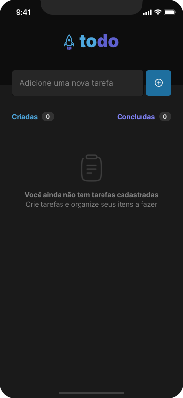
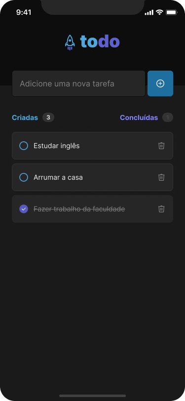

# Aplicativo de Checklist feito em React Native

Este é um aplicativo móvel desenvolvido em React Native que permite que você gerencie suas tarefas.

## Funcionalidades

- Adicione novas tarefas à sua lista.
- Marque tarefas como concluídas.
- Exclua tarefas que não são mais necessárias.
- Acompanhe o número total de tarefas criadas e concluídas.

## Capturas de Tela

## Instalação & Execução

1. Certifique-se de ter o ambiente de desenvolvimento React Native configurado em seu sistema.
2. Clone este repositório: `git clone https://github.com/lipenvs/app-todolist.git`
3. Instale as dependências: `npm install`
4. Execute o aplicativo via expo `npx expo start`

## Contribuição

Contribuições são bem-vindas! Sinta-se à vontade para abrir problemas e enviar solicitações pull.
